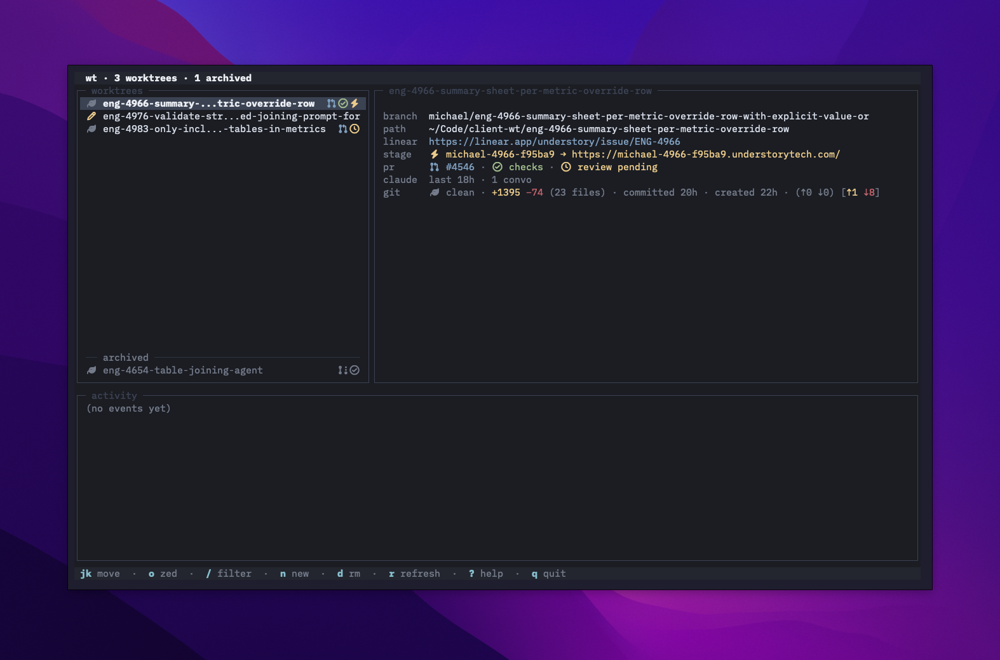

# wt

Terminal UI for keeping multiple git worktrees in flight at once. Each row shows live status, PR state, preview deployment, issue link, and coding-agent session activity (Claude Code, Codex, OpenCode) for one worktree, so the whole pile of in-progress work is visible on one screen. The details pane can also pull an AI-generated title and description for each branch from a local OpenAI-compatible LLM endpoint or Google's Gemini API.



## Requirements

**Required**

- [Bun](https://bun.sh) — runtime.
- `git` — worktree mechanics.
- A [Nerd Font](https://www.nerdfonts.com/) — the TUI uses Nerd Font glyphs for status, PRs, checks, merge-queue position, etc. Without one, those cells render as tofu.
- macOS — `open` and `pbcopy` are assumed for URL/clipboard handling; the webhook daemon installs as a launchd agent.

**Optional, per integration**

- `gh` (GitHub CLI, authenticated) — the PR row and every in-TUI PR action (auto-merge, mark ready, reviewers, CI log tails).
- `aws` CLI with a profile that can read your SST state bucket — when `[deploy.sst]` is configured (stage row + `wt stages`).
- `zed` CLI — `wt open` and the `o`/`O` keybindings (the editor is not currently configurable).
- [`revdiff`](https://github.com/umputun/revdiff) — the default F11 diff command. Override `[diff].command` to use `gitu`, `lazygit`, `tig`, a `delta` pipe, etc. instead.
- Linear — no CLI or token; issue URLs are constructed from branch slugs, and PRs can open in Linear Reviews.
- Coding agents — live sessions are *detected* by reading each agent's local files, no CLI needed; *spawning* from the TUI needs that agent's CLI on PATH (`claude`, `codex`, `opencode`). Claude is the most complete integration; Codex and OpenCode are partial today.
- An AI provider (OpenAI-compatible endpoint or Gemini) — the generated title + description in the details pane.

## Install

```sh
git clone https://github.com/micthiesen/wt.git ~/.wt
cd ~/.wt && bun install
```

Add to your shell rc:

```sh
alias wt='~/.wt/bin/wt'
```

## Configure

`wt` refuses to start without a config. The minimal `~/.config/wt/config.toml`:

```toml
[paths]
main_clone    = "~/Code/your-repo"
worktree_root = "~/Code/your-repo-wt"

[branch]
prefix = "yourname"   # branches you create get `yourname/<id>-<slug>`
```

Everything else is optional and section-gated: add `[deploy.sst]`, `[issue_tracker.linear]`, `[ai]`, or `[github.events]` to turn on that integration; omit it and the related rows hide themselves. The loader validates everything at startup and prints every missing or malformed field at once.

The full reference — every option, default, the `[[actions]]` menu, and `[[automations]]` — is in **[docs/configuration.md](docs/configuration.md)**.

## Use

`wt` with no arguments launches the TUI; press `?` inside for the full keymap and glyph legend. Subcommands (`wt new`, `wt rm`, `wt clean`, `wt restack`, …) run the same operations one-shot from a shell.

An optional `[remote]` SSH target lets `Ctrl+N` create worktrees on a second
machine while keeping them in the same Inbox; F10/F11/F12 route the selected
row's shell, diff, or AI session over SSH, and `d` removes it on that host
using the same safety checks as a local worktree. See
[`docs/configuration.md`](docs/configuration.md#remote--optional-ssh-worktree-host).

State is push-based: filesystem watchers on git refs, worktree dirs, and wt's own state feed the UI, so it tracks commits, pushes, installs, and deploys without manual refreshing. An optional webhook daemon extends that to GitHub-side events.

## Docs

| doc | contents |
|---|---|
| [docs/tui.md](docs/tui.md) | TUI tour: layout, full keymap, picker conventions |
| [docs/cli.md](docs/cli.md) | every subcommand and flag |
| [docs/configuration.md](docs/configuration.md) | complete config.toml reference |
| [docs/automations.md](docs/automations.md) | the `[[automations]]` engine: triggers, settle windows, breaker |
| [docs/github-events.md](docs/github-events.md) | push-based PR/CI updates via a repo webhook |
| [docs/stacked-prs.md](docs/stacked-prs.md) | stacked PRs: fork-base records, inferred stacks, `wt restack` |
| [docs/architecture.md](docs/architecture.md) | internals: layers, freshness model, module conventions |

## Logs

Every action and error goes to a daily file at `~/.cache/wt/logs/app/wt-YYYY-MM-DD.log` (14-day retention) — a strict superset of what the activity pane shows. Per-worktree destroy logs live at `~/.cache/wt/logs/<slug>-*.log`; `wt logs <slug>` tails the latest.
