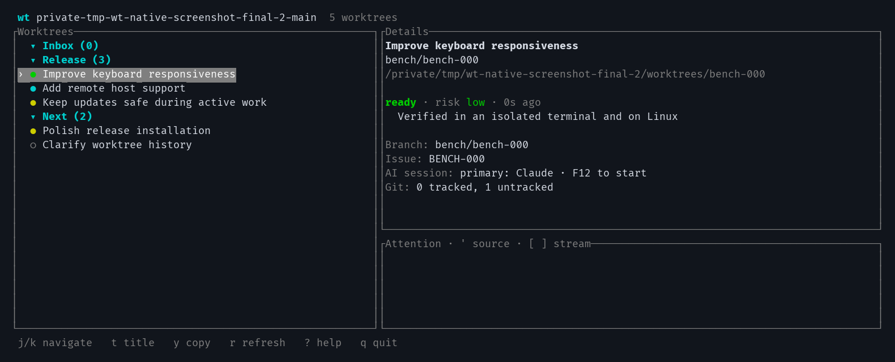

<p align="center"></p>

<p align="center"><b>Terminal UI for keeping multiple git worktrees in flight at once.</b></p>

<p align="center"><a href="https://discord.gg/DDnxyXQgF7"></a></p>

Each row shows live status, PR state, preview deployment, issue link, and coding-agent session activity (Claude Code, Codex, OpenCode) for one worktree, so the whole pile of in-progress work is visible on one screen. The configured coding-agent harness can also generate a title and description for each branch through its existing CLI authentication.

The design principle behind all of it: **the human does only the work only a human can do** (merges, logins, judgment calls). Agents assert a per-worktree work status (`wt status` — blocked-on-you / needs-testing / ready-to-merge, with a merge-risk level), the list auto-sorts by what needs you, automations ping only when human action is genuinely required, and a singleton manager session coordinates the fleet. The full rationale and agency model: **[docs/fleet.md](docs/fleet.md)**.



## Requirements

The published native releases support macOS and Linux on ARM64 and x86-64.
`git` is required for worktree operations and `tmux` is required for managed
terminal sessions. A [Nerd Font](https://www.nerdfonts.com/) is recommended for
the status and integration glyphs. No JavaScript runtime or source checkout is
needed to run an installed release.

**Optional, per integration**

- `gh` (GitHub CLI, authenticated) — the PR row and every in-TUI PR action (auto-merge, mark ready, reviewers, CI log tails).
- `aws` CLI with a profile that can read your SST state bucket — when `[deploy.sst]` is configured (stage row + `wt stages`).
- An editor — `wt open` and the `o`/`O` keybindings. `[editor] command` takes any launcher (`cursor {{path}}`, `code -n`, …); with the section omitted it drives `zed`, which additionally raises an already-open window rather than spawning a second one.
- [`revdiff`](https://github.com/umputun/revdiff) — what `[diff].command` defaults to, so F11 needs it installed unless you override the command. `gitu`, `lazygit`, `tig status`, a `delta` pipe or any script work equally well.
- Issue tracker — no CLI or token; the issue id is parsed from branch slugs and linked via a URL template (`[issue_tracker]`, with a Linear preset), and PRs can open in Linear Reviews.
- Dev server — one supervised `npm run dev`-style process per worktree (`[dev_server]`): wt-owned ports, crash restarts with give-up, tmux-backed so it survives wt restarts.
- Review bot — the CodeRabbit badge/automation track, retargetable at any PR-review bot (`[review_bot]`), including checklist-style GitHub Actions reviewers.
- Coding agents — live sessions are *detected* from each agent's local state; *spawning* from the TUI needs that agent's CLI on PATH (`claude`, `codex`, `opencode`). Claude and Codex support native queued inter-session delivery; OpenCode uses terminal delivery.
- A coding-agent CLI (`claude`, `codex`, or `opencode`) — live sessions and, when `[naming]` is configured, generated worktree titles and descriptions.
- [`rift`](https://github.com/anomalyco/rift) — required only when `[backend] kind = "rift"`; see [docs/backends.md](docs/backends.md).

## Install

Install the verified native release with the bootstrap script:

```sh
curl -fsSL https://github.com/micthiesen/wt/releases/latest/download/install.sh -o /tmp/wt-install.sh
sh /tmp/wt-install.sh --path
```

The installer verifies the release checksum and installs under
`~/.local/share/wt`; `--path` creates `~/.local/bin/wt` when it is available.
For development builds, use the workspace's Cargo commands instead.

`wt update` installs a verified stable or preview release. The launcher probes
the candidate before it becomes current, and `wt rollback` restores a previously
installed build. See [docs/updates.md](docs/updates.md). `wt version` prints the
native build identity and target.

## Configure

Keep personal defaults in `~/.config/wt/config.toml`, then initialize each
repository from anywhere inside it:

```sh
wt init
```

This creates a repository-local `.wt.toml`, detects the trunk branch, and
assigns a path-derived namespace (`~/dev/cz/cozee-dev` becomes
`dev-cz-cozee-dev`). The minimal merged configuration is:

```toml
[paths]
main_clone    = "~/Code/your-repo"
worktree_root = "~/Code/your-repo-wt"

[branch]
prefix = "yourname"   # branches you create get `yourname/<id>-<slug>`
```

Everything else is optional and section-gated: add `[deploy.sst]`, `[issue_tracker]`, `[review_bot]`, `[naming]`, or `[github.events]` to turn on or retarget that integration; omit it and the related rows hide themselves (the review-bot track defaults to CodeRabbit). The loader validates everything at startup and prints every missing or malformed field at once.

For multiple repositories, put shared personal defaults in the user config and add a `.wt.toml` at each repository root. Each wt process resolves one merged configuration at startup. Repository-specific values override user defaults. Durable state lives in SQLite and is partitioned by repository identity; disposable caches and runtime files live under the repository cache root.

The full reference — every option, default, the `[[actions]]` menu, and `[[automations]]` — is in **[docs/configuration.md](docs/configuration.md)**.

## Use

`wt` with no arguments launches the TUI; press `?` inside for the full keymap and glyph legend. Subcommands (`wt new`, `wt rm`, `wt clean`, `wt status`, `wt restack`, `wt manager`, …) run the same operations one-shot from a shell — `wt status` in particular is built for coding agents to call from inside their worktrees, and prints next-step guidance when they do.

The bottom pane defaults to a curated **attention feed** (status transitions, needs-you signals, errors); `"` cycles to the full event firehose. `m` attaches the [manager session](docs/manager.md), the singleton fleet coordinator.

wt also distributes the agent skills and instructions that make all of that work: at startup it offers pending updates y/n (declines remembered per version), following your symlinks and rulesync/dotfiles setup to install them durably for every harness on the machine — see [docs/skills.md](docs/skills.md).

Configured SSH workers run the exact matching native build. The controller
provisions a build-matched worker runtime and keeps remote worktree state beside
local rows; commands and sessions execute on the owning host. See
[`docs/configuration.md`](docs/configuration.md#remote--optional-ssh-worktree-host).

State is push-based: filesystem watchers on git refs, worktree dirs, and wt's own state feed the UI, so it tracks commits, pushes, installs, and deploys without manual refreshing. An optional webhook daemon extends that to GitHub-side events.

## Docs

| doc | contents |
|---|---|
| [docs/tui.md](docs/tui.md) | TUI tour: layout, full keymap, picker conventions |
| [docs/cli.md](docs/cli.md) | every subcommand and flag |
| [docs/configuration.md](docs/configuration.md) | complete config.toml reference |
| [docs/automations.md](docs/automations.md) | the `[[automations]]` engine: triggers, settle windows, breaker |
| [docs/fleet.md](docs/fleet.md) | the philosophy: minimal human work, work statuses, and the agency levels |
| [docs/skills.md](docs/skills.md) | agent skills & instructions distribution: startup updates, rulesync/symlink awareness |
| [docs/updates.md](docs/updates.md) | self-updates: CI-green targeting, boot probe, crash rollback, data migrations |
| [docs/manager.md](docs/manager.md) | the manager session: the singleton fleet coordinator (`m` / `wt manager`) |
| [docs/github-events.md](docs/github-events.md) | push-based PR/CI updates via a repo webhook |
| [docs/stacked-prs.md](docs/stacked-prs.md) | stacked PRs: fork-base records, inferred stacks, `wt restack` |
| [docs/backends.md](docs/backends.md) | worktree backends: `git-worktree` (default) vs `rift` copy-on-write clones |
| [docs/architecture.md](docs/architecture.md) | internals: layers, freshness model, module conventions |
| [docs/discord.md](docs/discord.md) | Discord server wiring: #updates digest, #github feed, badge |

## Community

Questions, ideas, or a setup to show off — join the [Discord](https://discord.gg/DDnxyXQgF7).

## Logs

Every action and error goes to a daily file at `~/.cache/wt/logs/app/wt-YYYY-MM-DD.log` (14-day retention) — a strict superset of what the activity pane shows. Per-worktree destroy logs live at `~/.cache/wt/logs/<slug>-*.log`; `wt logs <slug>` tails the latest.
